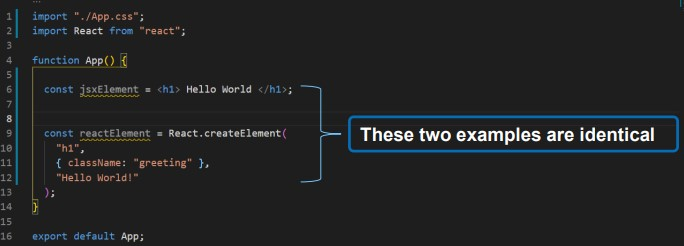

# About-REACT

## React is an open source JavaScript library for developing user interfaces. React can be used to develop single page and mobile applications

(russian language)
## React является открытым исходным кодомБиблиотека JavaScript дляразработка пользовательских интерфейсов.React можно использовать дляразработать одну страницу имобильные приложения.

# Who supports React?

## React is developed and maintained by Facebookand a community of individual developers and corporations.

(russian language)
## React разработан иподдерживается Facebookи сообщество индивидуальные разработчики и корпорации.

# Why learn React?

## React saves you time and money on development because it's component-based. You can break down an interface into reusable components that allow you to build dynamic user interfaces. This taps into the current thinking behind 'Design Systems'.

(russian language)
## React экономит ваше время и деньги наразвитие, потому что этона основе компонентов. Вы можете сломатьвниз интерфейс в многоразовыйкомпоненты, позволяющие построитьдинамические пользовательские интерфейсы. Это краныв текущее мышление позади«Дизайн-системы».

# What is NPM?

## npm is the default package manager for the JavaScript runtime environment Node.js.

(russian language)
## npm — пакет по умолчаниюменеджер для JavaScriptсреда выполнения Node.js.

# Create React App

## 1.Create a new folder with name of ReactApplications in Documents
npx create-react-app my-app
## 2.Open Directory in Visual Studio Terminal
cd my-app
## 3.Type below command
npm start

# React App Structure

# Introducing JSX

## It is called JSX, and it is a syntax extension to JavaScript. We recommend using it with React to describe what the UI should look like. JSX may remind you of a template language, but it comes with the full power of JavaScript.

(russian language)
## Он называется JSX и является расширением синтаксиса JavaScript. Мырекомендуем использовать его с React, чтобы описать, как должен выглядеть пользовательский интерфейснравиться. JSX может напоминать вам язык шаблонов, но он поставляется свся мощь JavaScript.

